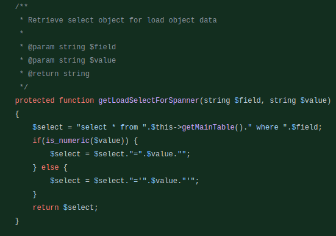
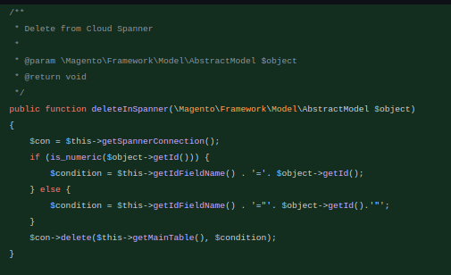

## **Overview**

This document describes how to integrate the open source
[[Magento](https://github.com/magento/magento2) ecommerce platform
with [Cloud Spanner](https://cloud.google.com/spanner/docs).

[Magento](https://github.com/magento/magento2) is a widely
popular PHP based open source ecommerce platform. In 2020, Magento was
considered to be a top eCommerce platform, offering an unprecedented
level of flexibility, excellent features and great capabilities. Magento
has over 250k active users and approximately 185K active websites have
been built with Magento.

The default MySQL backend for Magento works well for basic websites, but
performance bottlenecks, inability to scale for handling large volumes
of data and multi-region support has inhibited most of the PHP
application's usage for large scale enterprise applications with MySQL
as its backend. Challenges in customization and time consumption have
led enterprises to migrate from MySQL to other database offerings for
wider support.

This document is for PHP developers who are interested in integrating,
testing, and deploying Magento, or other PHP applications, with Cloud
Spanner.

[Spanner](https://cloud.google.com/spanner) is Google Cloud\'s
fully managed, enterprise-grade, distributed, and consistent database
which combines the benefits of the relational database model with
non-relational horizontal scalability. It is designed to support global
online transaction processing deployments, SQL semantics, highly
available horizontal scaling and transactional consistency. Spanner is
capable of handling large volumes of data. Its use is not limited to
applications of large size but it allows the standardisation of a single
database engine for all workloads requiring RDBMS. Spanner provides
zero-downtime for planned maintenance or region failures, with an
[availability SLA of
99.999%](https://cloud.google.com/spanner/sla). It supports modern
applications by providing high availability and scalability.

#### 

#### The Solution

Integrating PHP applications with Spanner would take care of the
following:

-   Efficient and effective way to handle high volume of data

-   Performance Enhancement

-   All time global support

-   Spanner delivers industry-leading 99.999% availability for
    > multi-regional instances

-   Scaling RDBMS solutions without complex sharding or clustering

-   Provides transparent, synchronous replication across region and
    > multi-region configurations

-   Process Optimization

#### Objectives

-   Install Magento on the local environment and a VM instance

-   Install the Spanner Emulator

-   Install HarbourBridge Tool for Data migration of MySQL to Spanner

-   Working on Magento Modules like Catalog, Wishlist and Cart and
    > integrating with Spanner

## Preparing the VM

Create a Compute Engine instance in Google Cloud Platform, by following
the steps mentioned
[here](https://cloud.google.com/compute/docs/instances/create-start-instance).
Clone the PHP application code for Magento which contains the
modifications for Catalog, Wishlist and Cart from
[Git](https://github.com/searceinc/magento-spanner-port) url
mentioned below.

  -----------------------------------------------------------------------
  https://github.com/searceinc/magento-spanner-port
  -----------------------------------------------------------------------

  -----------------------------------------------------------------------

Follow the steps in [Prerequisite
software](#install-prerequisite-software) mentioned above in this
document and install Apache, PHP, Elastic Search, Magento.

Install [Spanner
Emulator](https://cloud.google.com/spanner/docs/emulator) and
migrate the data using
[Harbourbridge](https://github.com/cloudspannerecosystem/harbourbridge)
as mentioned [above in this
document](#using-harbourbridge-to-migrate-mysql-to-spanner).

Deploy the Auto increment field to UUID by running the scripts mentioned
below to update table structures for the UUID changes.

  -----------------------------------------------------------------------------------------
  *https://github.com/searceinc/magento-spanner-port/blob/session-pool/db/UUID-alter.sql*
  -----------------------------------------------------------------------------------------

  -----------------------------------------------------------------------------------------

Deploy the Interleaved tables by running the scripts mentioned below to
update table structures for the Interleaved tables.

  -------------------------------------------------------------------------------------------------
  *https://github.com/searceinc/magento-spanner-port/blob/session-pool/db/interleaved-create.sql*
  -------------------------------------------------------------------------------------------------

  -------------------------------------------------------------------------------------------------

Verify the accessibility of the deployed application using url mentioned
below wherein DomainName refers to the DNS mapped:

-   http://\<DomainName>/

-   http://\<DomainName>/admin

## Cloning the magento2 repository

The Magento Commerce Cloud project is a
[Git](https://github.com/magento/magento2) repository of Magento
code and it includes a database and services to fully access the Magento
site and store.

1.  Clone the source repository and go to the directory for the project.

    > git clone [https://github.com/magento/magento2.git](https://github.com/magento/magento2.git)
 
    > cd magento2  

2.  Checkout a stable version. You can checkout a specific release
    > branch after cloning the latest code.

#### 

  -----------------------------------------------------------------------
  git checkout tags/2.4.2 -b 2.4.2
  -----------------------------------------------------------------------

  -----------------------------------------------------------------------

## 

## Install prerequisite software

We will need some prerequisite softwares as detailed below, to be
installed before we can install Magento

1.  Installing PHP modules required for Magento.

> sudo apt install php7.4-fpm php7.4-common php7.4-mysql php7.4-gmp php7.4-curl   

> sudo apt install php7.4-intl php7.4-mbstring php7.4-xmlrpc php7.4-gd php7.4-xml php7.4-cli php7.4-zip php7.4-bcmath php7.4-soap 

2.  Installing elasticsearch

> wget -qO - https://artifacts.elastic.co/GPG-KEY-elasticsearch | sudo apt-key add -                                                         
                                                                       
> sudo apt-get install apt-transport-https

> echo \"deb https://artifacts.elastic.co/packages/7.x/apt stable main\" \| sudo tee /etc/apt/sources.list.d/elastic-7.x.list           
                                                                      
>  sudo apt-get update && sudo apt-get install elasticsearch

>  sudo systemctl start elasticsearch.service                            

3.  Set folder permissions

> sudo find var generated vendor pub/static pub/media app/etc -type f -exec chmod g+w {}                                                  
                                                                      
> sudo find var generated vendor pub/static pub/media app/etc -type d -exec chmod g+ws {}                                                 
                                                                      
> sudo chown -R :www-data .                                             
                                                                      
> sudo chmod u+x bin/magento                                            

4.  Configure virtual host

Configure the Apache server for Magento by creating
/etc/apache2/sites-available/magento.conf and configuring the magento
folder.

    <VirtualHost *:80>
    ServerAdmin admin\@local-magento.com                                                                                                   
    DocumentRoot /var/www/html/magento/                                                                                             
    ServerName magento-poc.com                                                                                                                 
    ServerAlias www.magento-poc.com                                                                                                        
    <Directory /var/www/html/magento/>                                                                                                     
      Options Indexes FollowSymlinks MultiViews                                                                                      
      AllowOverride All                                                                                                                  
      Order allow,deny                                                                                                                
      allow from all                                                                                                                     
    </Directory>                                                                                                                
    ErrorLog \${APACHE_LOG_DIR}/error.log                                                                                   
    CustomLog \${APACHE_LOG_DIR}/access.log combined                                                                           
    </VirtualHost>                                                       

5.  Creating a symlink with the Apache default installation and the
    > repository

following command to create the empty database for the magento to be
installed in the next step

> cd \<your project location>
> ln -s . /var/www/html/magento

6.  Install packages

Magento 2 requires the composer 1.x version.

apt install composer
composer install

7.  Create Database for magento

Ensure mysql is installed in your environment. After logging into the
mysql terminal with a user that has CREATE DATABASE privileges, execute
the following command to create the empty database for the magento to be
installed in the next step

  -----------------------------------------------------------------------
  create database magento
  -----------------------------------------------------------------------

  -----------------------------------------------------------------------

8.  Install magento

  -----------------------------------------------------------------------
  *sudo bin/magento setup:install \--base-url=http://magento-poc.com/​
  \--db-host=localhost \\ \--db-name=magento \--db-user=magentouser
  \--db-password=\<\*\*\*\> \--admin-firstname=admin \\
  \--admin-lastname=demo \--admin-email=good\@example.com.com
  \--admin-user=admin \\ \--admin-password=\<\*\*\*\> \--language=en_US
  \--currency=INR \--timezone=Asia/Kolkata \\ \--use-rewrites=1*
  -----------------------------------------------------------------------

  -----------------------------------------------------------------------

### Verify your local workspace

To verify the local environment is hosting the server, access the store
using the URL you passed in the install command. For this example, you
can access the local Magento store using the following URL formats:

-   http://\<DomainName>/

-   http://\<DomainName>/admin

To change the URI for the Admin panel, use this command to locate it:

  -----------------------------------------------------------------------
  *php bin/magento info:adminuri*
  -----------------------------------------------------------------------

  -----------------------------------------------------------------------

To verify the Integration master branch environment, login to the
Project Web Interface and select your named project. In the list of
branches, select the Master branch. Click Access site to pull up a list
of URLs (HTTP and HTTPS) and click the preferred link to open the site.
To view the admin, add /admin or other configured Admin URI.

## Using the Spanner Emulator

The Cloud SDK provides a local, in-memory emulator, which you can use to
develop and test your applications for free without creating a GCP
Project or a billing account. As the emulator stores data only in
memory, all state, including data, schema, and configs, is lost on
restart. The emulator offers the same APIs as the Spanner production
service and is intended for local development and testing, not for
production deployments.

Please use the below link to refer further for installation, usage and
deployment of Emulator:

[Using the Spanner
Emulator](https://cloud.google.com/spanner/docs/emulator)

Once this is completed, in order to ensure seamless data retrieval and
processing, we will use "HarbourBridge", the tool that will help us
migrate the MySQL database to Spanner.

## Using HarbourBridge to migrate MySQL to Spanner 

Before we dive into integrating Spanner, we will use a tool called
HarbourBridge to convert the MySQL database that was created as part of
our Magento installation above to Spanner.

HarbourBridge

At its core,
[HarbourBridge](https://github.com/cloudspannerecosystem/harbourbridge)
provides an automated workflow for loading the contents of an existing
MySQL or PostgreSQL database into Spanner. It requires zero
configuration---no manifests or data maps to write. Instead, it imports
the source database, builds a Spanner schema, creates a new Spanner
database populated with data from the source database, and generates a
detailed assessment report. It is intended for loading databases up to a
few tens of GB for evaluation purposes, not full-scale migrations.

Bootstrapping for early stage migration

HarbourBridge bootstraps early-stage migration to Spanner by using an
existing MySQL or PostgreSQL source database to quickly get you running
on Spanner. It generates an assessment report with an overall
migration-fitness score for Spanner, a table-by-table analysis of type
mappings and a list of features used in the source database that aren\'t
supported by Spanner.

HarbourBridge can be used with the [Spanner
Emulator](https://cloud.google.com/spanner/docs/emulator), or
directly with a Spanner instance. The [HarbourBridge
README](https://github.com/cloudspannerecosystem/harbourbridge/blob/master/README.md) contains
a step-by-step [quick-start
guide](https://github.com/cloudspannerecosystem/harbourbridge/blob/master/README.md#quickstart-guide) for
using the tool with a Spanner instance.

HarbourBridge: Turnkey Spanner Evaluation

Installing HarbourBridge

1.  Installing HarbourBridge

> Download the tool to your machine and install it.

  -----------------------------------------------------------------------
  *GO111MODULE=on go get github.com/cloudspannerecosystem/harbourbridge*
  -----------------------------------------------------------------------

  -----------------------------------------------------------------------

2.  Migrate data

  -----------------------------------------------------------------------
  *mysqldump \--user=\'root\' \--password=\'\<password>\' \<mysql db
  name>\| go run github.com/cloudspannerecosystem/harbourbridge
  -driver=mysqldump -dbname=\<cloud spanner dbname>*
  -----------------------------------------------------------------------

  -----------------------------------------------------------------------

3.  Install the Spanner cli for running queries in the command line.

> spanner-cli is an interactive command line tool for Google Spanner.
>
> You can control your Spanner databases with idiomatic SQL commands.

  -----------------------------------------------------------------------
  *go get -u github.com/cloudspannerecosystem/spanner-cli*
  -----------------------------------------------------------------------

  -----------------------------------------------------------------------

Replace autoIncrement primary key field with UUID

By default MySQL supports an auto-incrementing numeric primary key
identifier. Since Spanner doesn't support auto increment fields we need
to generate the sequence programmatically.

Spanner recommends using
[UUID](https://cloud.google.com/spanner/docs/schema-design#uuid_primary_key)
for managing primary keys. Hence we need to convert the primary key from
integer to string to store the UUID. The UUID can be generated using any
standard format.

## Checking if the installation was successful

We have highlighted the key functionalities which are needed for
implementing on the Prototype and can be extended during the production
phase with ease. Hence the following steps will help you evaluate if the
installation was successful and functioning as intended.

-   Catalog module - One of the most important modules in Magento and
    > it's the main page of interaction between customer and retailer
    > wherein the product list is displayed

-   Adding, Deletion and Update of Wishlist - considered critical as
    > this function converts prospects to actual sales

-   Adding, Deletion and Update of Cart - is a critical function for the
    > user to decide on the final checkout and redirect to the final
    > payment gateway

Existing screen with MySQL

Code Modification:

To check if the code modifications reflect in the UI, we can follow the
steps below -

Refer the Github Link
[https://github.com/searceinc/magento-spanner-port](https://github.com/searceinc/magento-spanner-port)
for sample implementation.

-   Add Spanner Adapter for creating connection to Spanner.

-   Configure the Spanner instance and server information.

-   Add SpannerInterface and Spanner in the Adapter to implement the
    > connection to Spanner.

Refer /lib/internal/Magento/Framework/DB/Adapter/Spanner/Spanner.php and
/lib/internal/Magento/Framework/DB/Adapter/Spanner/SpannerInterface.php

ScreenShot of the Code Snippet:

Modify the AbstractDB class within Magento to now connect to Spanner
using the newly created Connection function within Spanner Adapter.
Refer /lib/internal/Magento/Framework/Data/Collection/AbstractDB.php

Screenshot of the Code Snippet:

Once the connection is established we need to modify the data fetch
method from the MySQL adapter to the Spanner adapter . Modify the
\_loadAttributes method in AbstractCollection to connect to Spanner and
fetch the data from Spanner.

Refer to
/app/code/Magento/Eav/Model/Entity/Collection/AbstractCollection.php

Screenshot of Code Snippet:

#### Visual Verification Scenarios for Catalog :

When the user clicks on menu items it loads the products from the
Catalog and displays on the screen. In this case the items (watches) are
loaded from Spanner.

Screenshot of the Site loaded from Spanner

Spanner Terminal screenshot to verify the Product in Catalog

Modify Spanner data via the terminal for one of the products and query
the data via terminal to confirm the modification in Spanner.

Reload the screen to confirm that the name of the watch is now changed
to "Aim Analog Spanner" as updated via the Spanner terminal.

### Wishlist

#### Wishlist Select

When a user tags a product under the wishlist category it must fetch the
data of that product and add it to the wishlist database of the
customer.

Screenshot of the Code Snippet : Modify the red highlighted section with
green highlighted code. Refer to the [[Github
link](https://github.com/searceinc/magento-spanner-port/commit/daa8ce2a246c165171a197dc994637bc45be116a)
for sample

Add a new method to load the data that is selected by the user

Load the required data and check if the same is reflected in the
shopping page.

#### Wishlist Add

The functionality for the Add to Wishlist function is that when the user
clicks on the Add to Wishlist Tab, the data of the product must be
retrieved and sent to the wishlist data table wherein it will be visible
according to the latest entry.

Refer to the code snippet below

#### Wishlist Modify

Updating the quantity of the item in the wishlist will modify the
wishlist. This happens mostly when the user wants to purchase an
additional quantity of the product which was pending in line in the
wishlist cart.

Refer to the code snippet below

Modify the existing method and replace the highlighted red section with
the highlighted green section to add or update wishlist in Spanner.

#### Wishlist Delete:

The Delete button or Remove button in the Wishlist page is when the user
feels that the product needs to be dropped from the wishlist and plans
to forgo any potential purchase of the same in future as well. Once the
delete button is pressed the product data in the wishlist table will be
removed thus the wishlist page will be refreshed without the deleted
product.

Refer to the code snippet below

#### Using UUID for Autoincrement 

For the primary Key column we need to generate UUID for reference.
Spanner recommends using UUID instead of auto incrementing ID. Add a new
method to generate UUID.

Please note that in case we still want to use the AutoIncrement logic of
Magento with MySql then modify this method to generate the next ID based
on the maximum value of the primary key column. This approach is not
scalable and has limitations. Hence the recommended approach of
generating UUID is followed.

Refer to code snippet below

#### Screenshots of Test cases for Wishlist

Scenario: Trying to update the wishlist when, before and after adding
the wishlist, and checking to see if the items chosen for the wishlist
are reflected in the wishlist page.

Screenshots for updating wishlist:

The Spanner Terminal shows that the quantity is updated as 2

After clicking on removing the items from the wishlist, the items get
removed from the wishlist screen and on refreshing the wishlist screen
it displays no items.

Execute the query in Spanner Terminal to verify the deleted items.

### Cart 

Cart is the page wherein the products that the user chooses to purchase
and buy are visible for review. The user can modify the cart by deleting
or adding further items before payment.

#### Cart Add

When a product is visible in the catalog page and the user chooses the
Add to Cart button the item will be added to the cart section for the
final payment. Code modification is similar to the wishlist. The date
has to be formatted in ISO format while adding the items to the cart.

Refer to the code snippet below

#### Cart Modify

Modify the items in the cart and update the code to handle the date
format. The same should reflect on the UI.

Refer to the code snippet below to find the reference in the repository

#### Cart Delete 

When the Delete option is selected the data of the item in the Cart
table is removed and the cart is refreshed with a final set of items for
checkout.

#### Sample screenshots to verify Add Cart Screen

## 

## 

## Cleaning up

When the POC setup and validation is completed, it is advised to delete
the GCP resources created during the process along with the Compute
Engine Instance.

## 

## What\'s next

This is just a prototype model for the POC. This deals with the key
requirement of the stakeholder to migrate PHP applications to utilize
Spanner. This allows scaling to a large volume of users that can be
handled globally in a seamless and sustainable manner. This is
beneficial for the user, retailer and the third party who manages the
Data. Thus, they can see large degree improvements in performance,
efficiency, accuracy in terms of Process and Data Management.
